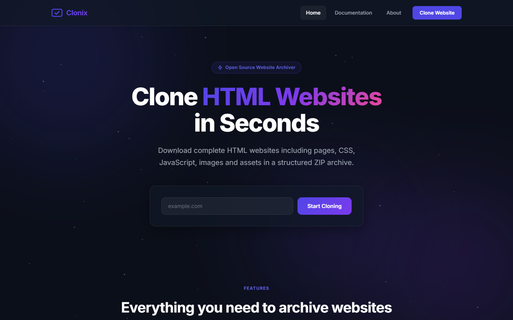
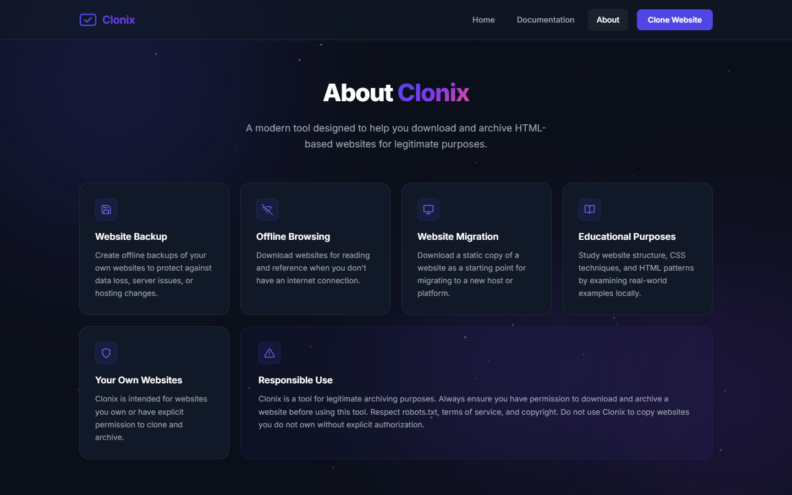
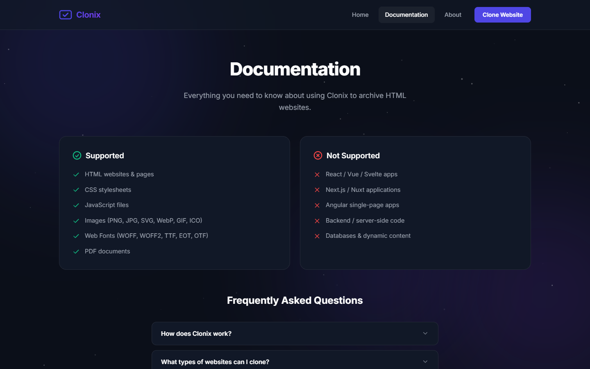

<div align="center">
  
  # 📦 Clonix

  **Download and archive any HTML website with its pages and assets.**

  [](https://nodejs.org/)
  [](https://expressjs.com/)
  [](LICENSE)

</div>

## 🌟 Overview

**Clonix** is a modern, premium full-stack web application designed to help you download and archive HTML-based websites. Enter a URL, and Clonix will recursively discover pages, download CSS, JavaScript, images, and fonts, and package everything into a beautifully structured ZIP archive—all while preserving the original folder structure.

Whether you're creating offline backups, migrating hosts, or studying web architecture locally, Clonix provides a fast, trustworthy, and visually stunning experience.

---

## 📸 Screenshots

### 🏠 Home View


### ℹ️ About View


### 📚 Documentation


---

## ✨ Features

- **🕸️ Recursive Page Discovery:** Automatically crawls internal links to find all HTML pages belonging to the domain.
- **📥 Asset Downloader:** Extracts and downloads stylesheets, scripts, images (PNG, JPG, WebP, SVG, ICO), web fonts, and PDFs.
- **🗂️ Folder Structure Preservation:** Organises all assets into logical directories mirroring the original site.
- **📦 ZIP Export:** Compresses everything into a single, ready-to-use `.zip` file.
- **🚀 Fast Processing:** Processes downloads concurrently in batches to maximise speed while avoiding system overload.
- **🛡️ Built-in Conflict Resolution:** Gracefully handles file/directory name collisions.
- **✨ Premium UI/UX:** A stunning dark-mode interface built with Vanilla CSS, featuring glassmorphism, micro-animations, and live progress tracking.

---

## 🛠️ Technology Stack

**Frontend:**
- Vanilla HTML5
- Vanilla CSS3 (Custom Design System, Dark Mode)
- Vanilla JavaScript (SSE for live progress updates)

**Backend:**
- Node.js & Express.js
- `axios` (HTTP requests)
- `cheerio` (HTML parsing)
- `archiver` (ZIP generation)
- `fs-extra` (Filesystem operations)

---

## 🚀 Getting Started

### Prerequisites
Make sure you have [Node.js](https://nodejs.org/) (v16 or newer) installed.

### Installation

1. **Clone the repository:**
   ```bash
   git clone https://github.com/dsagnik/clonix.git
   cd clonix
   ```

2. **Install dependencies:**
   ```bash
   npm install
   ```

3. **Start the server:**
   ```bash
   npm start
   ```

4. **Open the app:**
   Navigate to `http://localhost:3000` in your web browser.

---

## 🏗️ Architecture

Clonix processes websites through a four-stage pipeline:

1. **Crawler (`crawler.js`):** Fetches the root URL, traverses internal links, and builds a manifest of all pages and assets.
2. **Downloader (`downloader.js`):** Downloads the discovered assets in parallel batches, creating necessary directories in a `.tmp` folder.
3. **Zipper (`zipper.js`):** Streams the downloaded files into a compressed `.zip` archive.
4. **Server (`server.js`):** Orchestrates the pipeline and communicates live progress to the frontend using Server-Sent Events (SSE).

---

## ⚠️ Responsible Use

Clonix is a tool intended for legitimate archiving purposes. 
- **Always ensure you have permission** to download and archive a website before using this tool.
- **Respect `robots.txt`**, terms of service, and copyright laws.
- **Do not** use Clonix to copy or steal websites you do not own without explicit authorization.

---

## 📝 License

This project is licensed under the MIT License.
